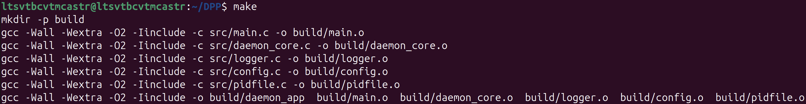
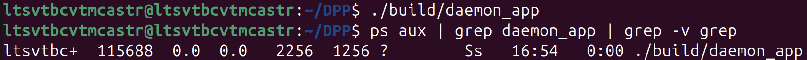
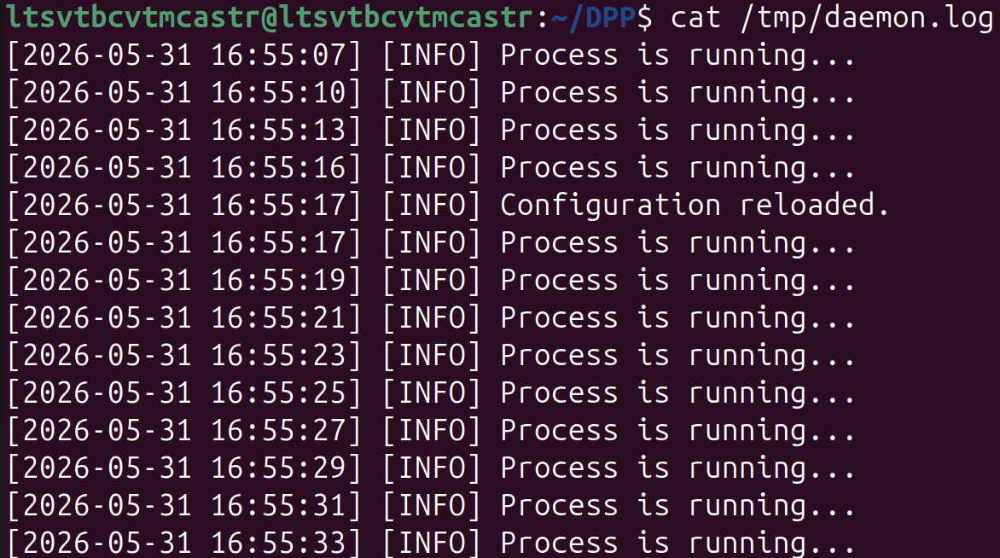
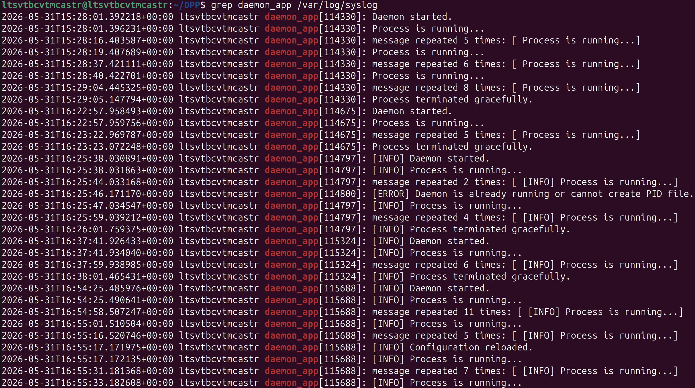

# Mini-Project: Development of a System Daemon 

## 1. Objective
To investigate the principles of background processes (daemons) in POSIX-compliant operating systems. To master the mechanisms of detaching a process from the controlling terminal, handling system signals, interacting with the file system, and integrating with the system journal (`syslog`).

## 2. Implementation and Architecture
The software complex is implemented in C following a modular architecture.

**Process Creation:**
Converting a standard process into a daemon is achieved by creating a child process (`fork()`) and immediately terminating the parent process. This returns control to the command shell. The child process then creates a new session (`setsid()`), becoming the session leader and detaching from the controlling terminal.

**Resource Utilization:**
The process changes its working directory to the root directory (`/`) to prevent locking any mounted file systems. Standard input/output streams (`stdin`, `stdout`, `stderr`) are closed. The application utilizes file descriptors for a custom log file and a PID file.

**Error Handling and Termination Behavior:**
- System calls (`fork`, `setsid`, `chdir`, `open`, `write`) are wrapped with return code checks. In case of a critical error during initialization, the program terminates with the `EXIT_FAILURE` code.
- The program utilizes a PID file (`/tmp/daemon_app.pid`) with an exclusive write lock (`fcntl`) to prevent race conditions and ensure that only a single instance of the daemon is running.
- **Abnormal Termination:** If the `SIGKILL` (kill -9) signal is sent, the process is immediately destroyed by the OS kernel, and the PID file remains in the system. However, upon the next launch, the program will overwrite it (using `ftruncate`), as the OS automatically releases the file lock upon process death.
- **Graceful Termination:** Upon receiving `SIGTERM` or `SIGINT` signals, the daemon exits its main loop, writes a final shutdown message to the log, safely closes file descriptors, and removes the PID file.

## 3. Utilized System Calls
The following POSIX system calls and library functions were utilized during development:
* `fork()` — creation of a child process.
* `setsid()` — creation of a new session and detachment from the terminal.
* `umask()` — setting the file mode creation mask to clear inherited permissions.
* `chdir()` — changing the current working directory.
* `close()` — closing standard file descriptors.
* `open()`, `write()`, `ftruncate()`, `unlink()` — PID file operations.
* `fcntl()` — applying a write lock to the PID file.
* `signal()` — registration of interrupt handlers.
* `syslog()`, `openlog()`, `closelog()` — integration with the system event journal.
* `getopt()` — parsing command-line arguments.

## 4. Usage Example and Instructions

### Building the Project
The `make` utility is used for compilation:
```bash
make
```

### Execution and Arguments
The program supports command-line arguments. By default, the configuration file is expected at `/tmp/daemon.conf`.
```bash
# Launch with a custom configuration file path
./build/daemon_app -c /path/to/custom.conf

# Display help message
./build/daemon_app -h
```

### Daemon Control
Reloading the configuration "on the fly" (without stopping the process) is performed by sending the `SIGHUP` signal:
```bash
pkill -HUP daemon_app
```
Graceful shutdown (sending `SIGTERM`):
```bash
pkill daemon_app
```

## 5. Screenshots

### Project Compilation


### Execution and Background Process Verification


### Custom Logger and Configuration Reloading


### System Journal Integration (syslog)


## 6. Conclusion
During this mini-project, a system daemon strictly adhering to POSIX standards was successfully implemented. The application correctly detaches from the terminal, is protected against multiple instances via PID file locking, supports hot-reloading of its configuration via the `SIGHUP` signal, and maintains a dual-level logging system (custom file + `syslog`). Robust error handling for system calls and proper resource deallocation upon termination have been ensured.